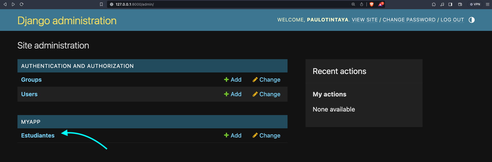
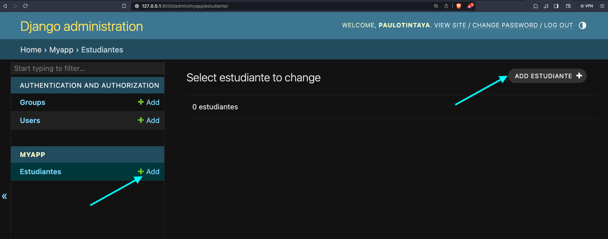
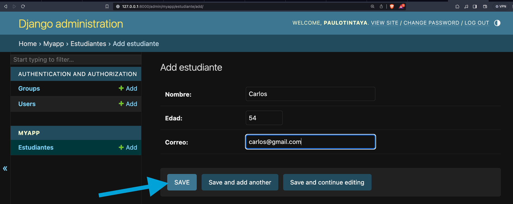

# Django First App

Una corta de guia de la creacion de nuestra primera app con Django sobre datos de Estudiantes


## Creacion de un entorno virtual

 - [Guia Windows](https://micro.recursospython.com/recursos/como-crear-un-entorno-virtual-venv.html)

    1. Abre el CMD y ubícate en la carpeta en donde quieres crear el entorno virtual
    2. Ejecuta ```python -m venv mi_entorno```
    3. Ejecuta ```mi_entorno\Scripts\activate```
    


PD:
    Por cierto, es una buena práctica usar venv o env como los nombres del entorno virtual.
    Puedes activar el entorno virtual también haciendo ```mi_entorno\Scripts\activate.bat```, es exactamente lo mismo.

## Instalacion

Instala el framework django

```
  pip install django
```
    
    

## Empezamos con el proyecto
Creamos el proyecto de nombre `base`
```
    django-admin startproject base
```

Accedemos dentro de la carpeta del proyecto `base`

```
    cd base
```

Creamos una aplicacion dentro del proyecto
```
    python manage.py startapp myapp
```

Ahora dentro en la carpeta `base/settings.py`

debemos agregar lo siguiente en `INSTALLED_APPS` el nombre de nuestra aplicacion
```
INSTALLED_APPS = [
    'django.contrib.admin',
    'django.contrib.auth',
    'django.contrib.contenttypes',
    'django.contrib.sessions',
    'django.contrib.messages',
    'django.contrib.staticfiles',
    'myapp', #añadimos esta linea
]
```


## Creamos nuestro primer modelo

En el archivo `myapp/models.py`

```
from django.db import models

# Create your models here.
class Estudiante(models.Model):
    nombre = models.CharField(max_length=100)
    edad = models.IntegerField()
    correo = models.EmailField()

```

Ahora realizamos las migraciones con los siguientes comando en consola

```
    # Crea migraciones para tu modelo de estudiante para definir cómo se estructurará la base de datos
    python manage.py makemigrations myapp

```
```
    # Luego, aplica las migraciones para crear la tabla en la base de datos
    python manage.py migrate
```
Ahora si observa la base de datos `db.sqlite3` ya se encuentran creadas las tablas

## Creamos la vista para nuestro modelo
En el archivo `myapp/views.py`

```
from django.http import HttpResponse, JsonResponse
from django.shortcuts import render
from .models import Estudiante

# Create your views here.
def listar_estudiantes(request):
    # obtenemos todos los registros en nuestra base de datos de tipo Estudiante
    data = Estudiante.objects.all() 
    # en nuestra nueva lista tendremos una lista de diccionarios para poder mostrar los datos como json
    new_data = []
    for elem in data:
        new_data.append({'nombre': elem.nombre, 'edad': elem.edad, 'correo': elem.correo})
    return JsonResponse(new_data, safe=False)
```

## Ahora configuramos el endpoint(ruta) para nuestra vista
En el archivo `base/urls.py`
```
from django.contrib import admin
from django.urls import path
from myapp.views import listar_estudiantes # importamos la vista de nuestra app

urlpatterns = [
    path('admin/', admin.site.urls),
    path('estudiantes/', listar_estudiantes)
]
```

## Iniciamos el servidor de nuestro proyecto
```bash
    python manage.py runserver
```

Una vez levantado nuestro servidor, podemos visitar la ruta que creamos:

http://127.0.0.1:8000/estudiantes/

*Esta ruta nos mostrara una lista vacia en nuestro navegador, debido a que nuestra tabla de Estudiantes aun no tiene ningun valor añadido aun

## Exploramos el panel de admin para poder insertar datos a la tabla Estudiante

Visitamos la ruta http://127.0.0.1:8000/admin/ que nos pide unos datos de `username` y `password`

Volvemos a nuestra consola y presionamos `ctrl + c` para salir del servidor

ahora en consola nos crearemos un superusuario

```
    python manage.py createsuperuser
```
Completa los datos que te piden anotar como nombre de ususario, correo y contraseña

## Registramos el modelo Estudiante en el administrador

en el archivo `myapp/admin.py`

```
from django.contrib import admin
from .models import Estudiante

admin.site.register(Estudiante)

```

Ahora en consola levantamos el servidor de nuestro proyecto y visitamos la ruta  http://127.0.0.1:8000/admin
donde ahora podremos crear datos para nuestra tabla Estudiante

Ingresa a la tabla de Estudiante


Crea un nuevo dato Estudiante

Guarda la imagen


Ahora con datos creados vuelve a visitar http://127.0.0.1:8000/estudiantes/ para ver el listado de estudiantes
